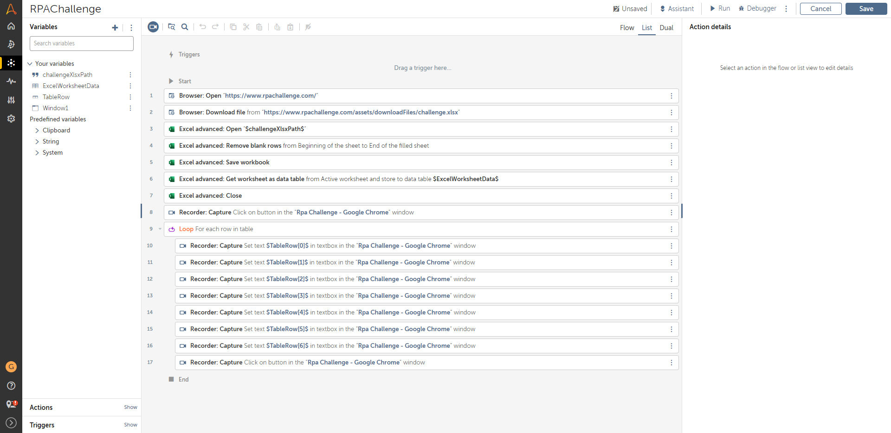
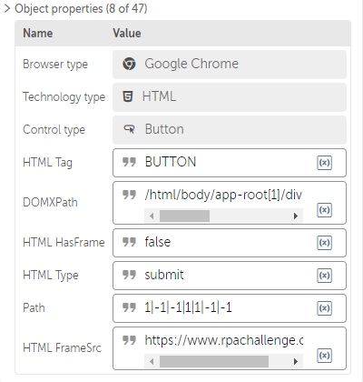
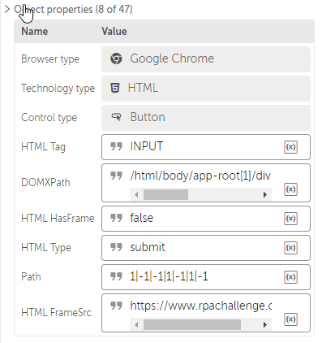

# RPA Challenge done by Automation Anywhere bot

This repo details how to build a Automation Anywhere bot that solves the [RPA challenge](https://www.rpachallenge.com/). As I couldn't find a way to export the bot's metadata or similar to add to this repo, this README describes the steps to reproduce the said bot.

The following image shows the bot in Automation Anywhere 360 (AA360).

The following steps show how to create the bot. The steps start after you create the bot on the control room and start editing it.

## Creating the variables

**Creating the `Window` variable:**

1. Open Google Chrome.
1. Navigate to `https://www.rpachallenge.com/`.
1. On AA360, show the variables of your bot.
1. Click the **Create variable** plus sign icon.
1. On **Type**, select `Window`.
1. On **Name**, set `Window`.
1. Select **Constant (read-only)**.
1. On **Default value**, select `Application`.
1. Select `Rpa Challenge - Google Chrome`.
1. On **Window title**, select `String`.
1. Set `Rpa Challenge - Google Chrome`.
1. Select **Case sensitive**.
1. Click **Create**.

**Creating the `String` variable:**

1. Click the **Create variable** plus sign icon.
1. On **Type**, select `String`.
1. On **Name**, set `challengeXlsxPath`.
1. Select **Constant (read-only)**.
1. On **Default value**, set `%USERPROFILE%\Downloads\challenge.xlsx`.

    The previous file path should be the file path that Google Chrome defaults to. You could add any other path of your liking, as long as it finishes with the `.xlsx` extension.

## Adding the browser piece

1. Add the **Browser: Open** action.
    1. Set to open a **new window**.
    1. Set the browser as **Google Chrome**.
    1. Set to open the following link: `https://www.rpachallenge.com/`.
1. Add the **Browser: Download file** action.
    1. On **URL to open**, set `https://www.rpachallenge.com/assets/downloadFiles/challenge.xlsx`
    1. On **Save to location**, set `$challengeXlsxPath$`.
    1. Select **Overwrite existing file**.

## Reading the Excel data

1. Add the **Excel advanced: Open** action.
    1. Select **File**.
    1. Select **Desktop file**.
    1. Set `$challengeXlsxPath$` as the file.
    1. Select **Sheet contains headers**.
    1. Select **Read-write mode**.
    1. Make sure that the Excel session is set as **Local session** and named `Default`.
1. Add the **Excel advanced: Remove blank rows** action.
    1. Select **Beginning of the sheet**.
    1. Select **End of the filled sheet**.
1. Add the **Excel advanced: Save workbook** action.
1. Add the **Excel advanced: Get worksheet as data table** action.
    1. Select **Active worksheet**.
    1. Select **Sheet contains a header**.
    1. Select **Read visible text in cell**.
    1. On **Assign value to the variable**, set `ExcelWorksheetData`. This should be filled as the default value.
1. Add the **Excel advanced: Close** action.

## Recording the clicks and inputs

At this point, you will need to record your actions on the RPA Challenge page. The catch, though, is that only two of the recorded actions work; the others, don't, because the challenge is all about that: the input elements are dynamic.

However, AA360 forces you to capture the objects that you want to reference, so it is better to just record everything and edit later.

1. Click the **Start recording** camera icon.
1. Select the **Universal recorder**. The AI recorder got lost for some reason.
1. Make sure the window is set to the proper RPA Challenge page window.
1. On the RPA Challenge page, click **Start**.
1. For each text input available on the form:
    1. Click the input field.
    1. Type `a`.
1. In the end, click **Submit**.
1. Finish the recording.

AA360 should load the recorded actions on your bot script. Only the actions of clicking `Start` and clicking `Submit` are usable; you need to edit the actions of setting the input fields, [which we will do later](#editing-the-actions-of-setting-the-input-fields).

The following images show the **Object properties** of both clicks. You can use them to make sure your actions of clicking Start and Submit have the same element references.

||
|:---:|
|*The object properties of the action to click the Start button.*|

||
|:---:|
|*The object properties of the action to click the Submit button.*|

## Looping each data row

On [Reading the Excel data](#reading-the-excel-data), you got a data table with the data from the Excel. Now you need to loop through all of them.

1. Add the **Loop** action.
    1. On **Loop Type**, select `Iterator`.
    1. On **Iterator**, select `For each row in table`, part of the **Data Table** iterator.
    1. On **Table variable**, select `ExcelWorksheetData`.
    1. On **Assign the current row to this variable**, select `Record`.
    1. Click the icon to **Create variable** and create the `TableRow` variable. Its type is `Record`.
1. Hold the `Ctrl` key on your keyboard and, with your mouse, left click all the **Recorder: Capture** actions that set text to the input fields. There must be 7 of them.
1. With all of them selected, left click and drag them under the **Loop** action.
1. Drag and drop inside the loop the **Recorder: Capture** action that click the **Submit** button on the RPA Challenge page.

## Editing the actions of setting the input fields
    
You need to edit all the **Recorder: Capture** actions that set text to the input field. For each of the **Recorder: Capture** actions that set text to the input fields, do the following steps:

1. Edit their **Object properties** so it only has the following property names enabled: **Browser type**, **Technology type**, **Control type**, **HTML Tag**, **DOMXPath**.
1. Make sure **Browser type** is set to `Google Chrome`.
1. Make sure **Technology type** is set to `HTML`.
1. Make sure **Control type** is set to `Textbox`.
1. Make sure **HTML Tag** is set to `INPUT`.

Now you need to edit the **Keystrokes** and the **DOMXPath** of all the **Recorder: Capture** actions that set text to the input fields of the RPA Challenge page so they match the following keystroke-DOMXPath mapping:

|Keystrokes' value|DOMXPath value|
|:---:|:---:|
|`$TableRow[0]$`|`//input[@ng-reflect-name="labelFirstName"]`|
|`$TableRow[1]$`|`//input[@ng-reflect-name="labelLastName"]`|
|`$TableRow[2]$`|`//input[@ng-reflect-name="labelCompanyName"]`|
|`$TableRow[3]$`|`//input[@ng-reflect-name="labelRole"]`|
|`$TableRow[4]$`|`//input[@ng-reflect-name="labelAddress"]`|
|`$TableRow[5]$`|`//input[@ng-reflect-name="labelEmail"]`|
|`$TableRow[6]$`|`//input[@ng-reflect-name="labelPhone"]`|

## Validating the bot

If you followed all the steps according to this tutorial, your bot's script should look like the script shown in the following image.

If the actions of your bot differs, redo the steps to make sure you replicate the tutorial.
